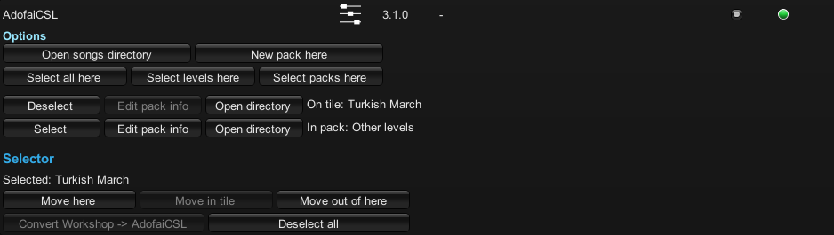
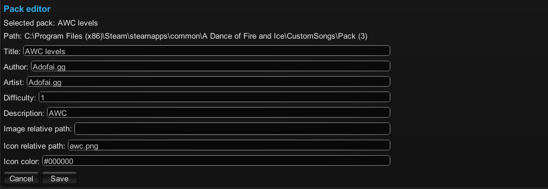

# AdofaiCSL
ADOFAI (A Dance of Fire and Ice) mod

On the first launch, the mod will create a folder named `CustomSongs` in the game files: this is where you will put your levels and packs

Custom levels and packs are found in-game next to your workshop levels

## Features
- Load levels without the workshop
- Load packs
- GUI to select/move levels and packs

## Add an existing level/pack
- Go to `CustomSongs` in the game files
- Put your level/pack folder in there
- Note: If the level/pack isn't already in a folder, create one for it

## Create a pack
Recommended: Use the GUI to create the pack
If you want to do it manually:
- Go to `CustomSongs` in the game files
- Create a new folder for your pack and create a `main.pack` file in it
- Add your pack info in `main.pack` ([Example](./example.pack))
- Note:
  - Difficulty is a number between 1 and 10
  - Color is the icon color and needs to be a hex code.
  - Everything is optional
- Once your pack is created, you can add levels to it like you would add them normally.

## In-game GUI
In the mod manager's settings (CTRL + F10), the mod has a GUI to help you manage your custom songs:
- Open the `CustomSongs` folder easily
- Select levels/packs
- Create new packs
- Edit packs

## Issues and questions
You can DM me on discord (`@ika7533`) or create a github issue.

## Credits
Thanks to `@thijnmens` for allowing me to maintain the project.
