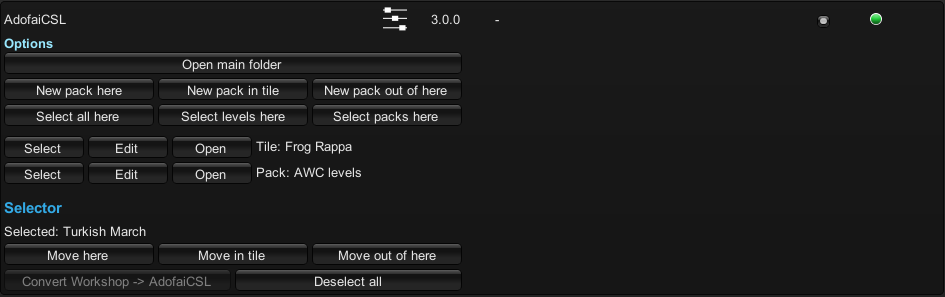
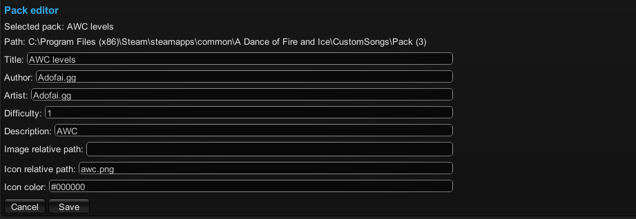

# AdofaiCSL

Custom song loader for non-workshop levels.

## Features

- Loads directories directly as if they were workshop levels.
- Allows pack loading.
- GUI to help manage custom songs.

## In-game options (GUI)

The in-game options has features to help manage custom songs, you can access it in UnityModManager's settings, which you can open by pressing CTRL + F10.
The GUI allows you to:
- Select multiple tiles and:
  - Convert them from Workshop levels to AdofaiCSL (required for the other features to work).
  - Move them in packs, or out of packs.
- Create new packs.
- Edit packs.
- Open custom songs directories.

## Instructions

Open adofai once with the mod installed, this will create a folder called `CustomSongs` in the game directory.

### Add a level or a pack

- Go to the `CustomSongs` folder.
- Create a new folder for the root of your level/pack if the location where you are copying it from isn't bundled in a folder already.
- Add your `main.adofai` chart file or your `main.pack` config file and any other needed files to the folder.

### Create a pack manually

1. Inside the `CustomSongs` folder, create a new folder, this will be the root of your pack.
2. Inside the new folder, create a `main.pack` file.
3. Open the pack file in a text editor and paste in the [template](https://pastebin.com/raw/9GBX2TDB). The difficulty is a number between 1 and 10, and the color (icon color) is a valid hex color code. Everything is optional.
4. You can add levels and packs in the newly created folder.

## Help

You can always DM on discord, `@ika7533` or create a github issue.

## Credits

Thanks to `@thijnmens` for allowing me to maintain the project.
